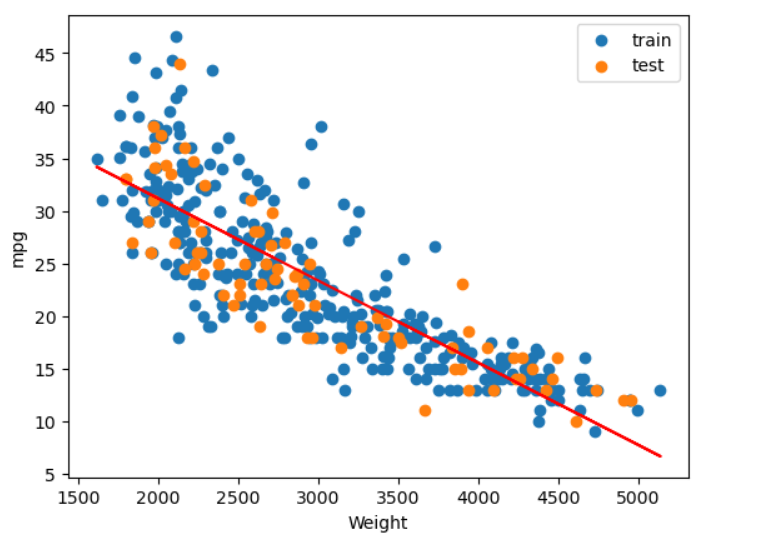
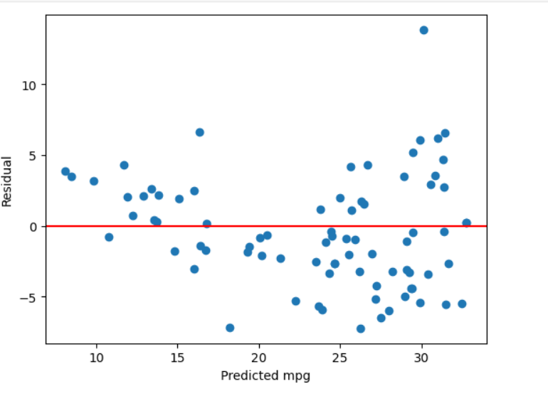
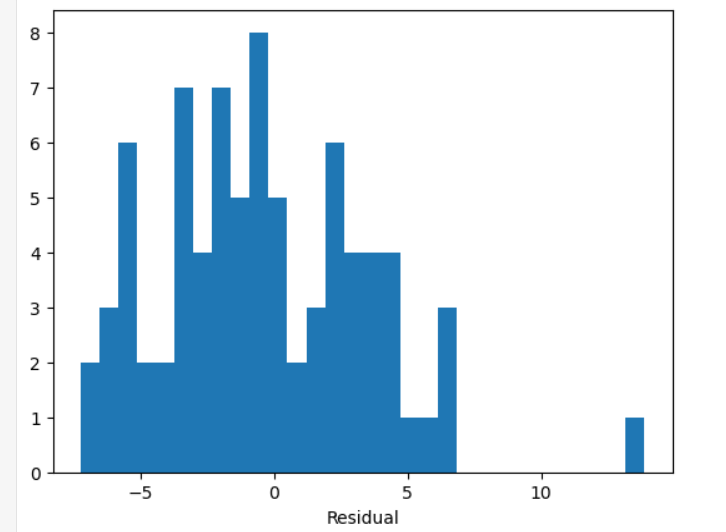
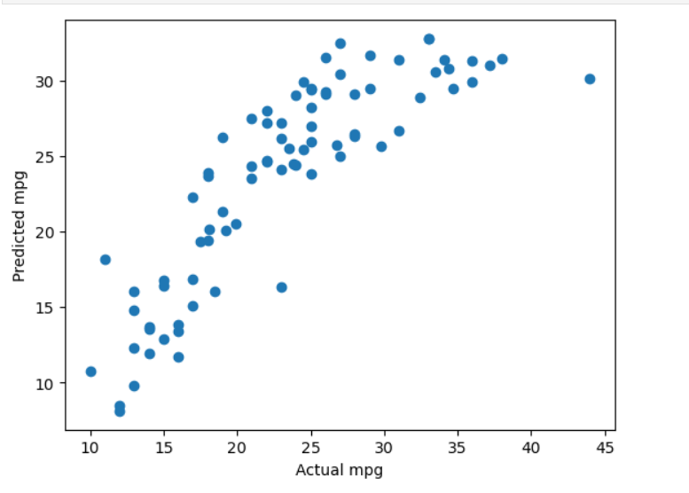
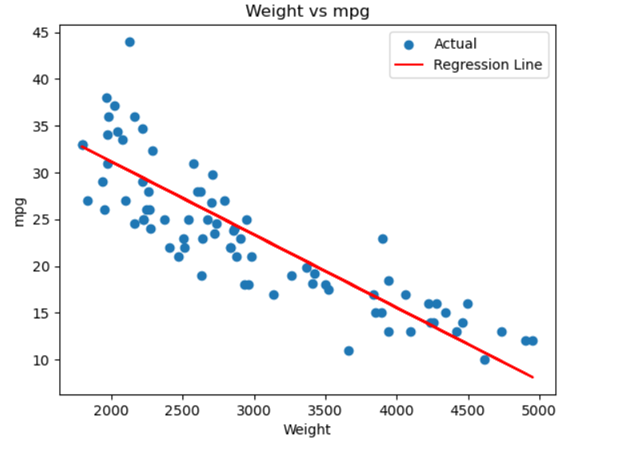
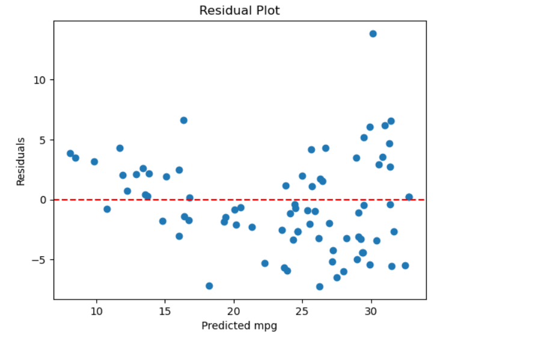

# Linear Regression using the Normal Equation

Predict a car's fuel efficiency (**mpg**) from its **weight**, using the closed-form least-squares solution. The model is built twice and the results are compared:

- **From scratch**: transpose, matrix multiplication and matrix inverse (Gauss-Jordan elimination) all written by hand.
- **With a library**: the same problem solved with scikit-learn's `LinearRegression`.

**Result:** both give exactly the same line, `mpg = 46.78 − 0.00781 × weight`, with a test R² of 0.723.

---

## The idea

Linear regression fits a line

$$\hat{y} = b + w\,x$$

by choosing the intercept $b$ and slope $w$ that minimise the **residual sum of squares**:

$$\text{RSS}(\beta) = (y - X\beta)^T (y - X\beta)$$

Here $X$ is the data matrix with a column of 1s (so the intercept is treated like any other weight) next to the feature column, and $\beta = [b, w]^T$.

Differentiating and setting the gradient to zero gives the **normal equations**:

$$\frac{\partial\,\text{RSS}}{\partial \beta} = -2X^T y + 2X^T X \beta = 0 \;\;\Rightarrow\;\; X^T X \beta = X^T y$$

and multiplying both sides on the left by $(X^TX)^{-1}$ gives the closed-form solution:

$$\boxed{\beta = (X^T X)^{-1} X^T y}$$

There are no iterations and no learning rate: one calculation gives the exact minimum of RSS. The solution exists when $X^TX$ is invertible, i.e. when the columns of $X$ are linearly independent.

The complete step-by-step derivation is handwritten in [`Derivation/`](Derivation/Univariate_Linear_Regression_Derivation_Closed_Form.pdf).

---

## Dataset

**Auto MPG**: 398 cars. This project uses two columns.

| Column | Role |
|---|---|
| `weight` | feature ($x$) |
| `mpg` | target ($y$) |

- Two missing `horsepower` values are filled with the mean. This does not affect the model, because horsepower is not used here.
- **Source:** R. Quinlan (1993). *Auto MPG* [Dataset]. UCI Machine Learning Repository. https://doi.org/10.24432/C5859H
- **Licence:** CC BY 4.0. The CSV in this repository is a processed copy (car-name column removed, column names changed).

---

## Notebooks

| Notebook | What it does |
|---|---|
| [`Linear_Regression_from_scratch_using_normal_equation.ipynb`](Linear_Regression_from_scratch_using_normal_equation.ipynb) | Builds $X$ and $y$, splits the data, computes $X^TX$ and $X^Ty$ with hand-written loops, inverts with hand-written Gauss-Jordan elimination, solves for $\beta$, evaluates, plots |
| [`Univariate_Linear_Regression_using_standard_library.ipynb`](Univariate_Linear_Regression_using_standard_library.ipynb) | Same problem with `train_test_split` and `LinearRegression` from scikit-learn |

### Steps in the from-scratch notebook

1. Build $X$ (column of 1s + weight) and $y$
2. Train/test split (80% / 20%)
3. Transpose $X_{train}$ (hand-written)
4. Matrix multiplication for $X^TX$ and $X^Ty$ (hand-written, training data only)
5. Inverse of $X^TX$ (hand-written Gauss-Jordan elimination)
6. Solve $\beta = (X^TX)^{-1}X^Ty$
7. Evaluate on the test set (MAE, MSE, RMSE, R²)
8. Plots

**About the inverse:** $X^TX$ is placed next to the identity matrix and row-reduced until the left side becomes the identity, which leaves $(X^TX)^{-1}$ on the right. NumPy (`np.linalg.inv`, `@`) is used only to cross-check the hand-written results with `np.allclose`.

### Same split everywhere

Every notebook in this repository uses `train_test_split(..., test_size=0.2, random_state=42)` on the same 398 rows. The split is therefore identical (318 training cars, 80 test cars), so the from-scratch and library results can be compared directly.

---

## Results

| | From scratch | scikit-learn |
|---|---|---|
| Intercept $b$ | 46.78 | 46.78 |
| Slope $w$ | −0.00781 | −0.00781 |
| MAE (test) | 3.12 | 3.12 |
| MSE (test) | 14.89 | 14.89 |
| RMSE (test) | 3.86 | 3.86 |
| R² (test) | 0.723 | 0.723 |

**Fitted line:**

$$\widehat{\text{mpg}} = 46.78 - 0.00781 \times \text{weight}$$

**Reading it:**

- Each extra 1000 lb of weight lowers predicted mpg by about **7.8**.
- Weight alone explains about **72%** of the variation in mpg on unseen cars.
- A typical prediction is off by about **4 mpg** (RMSE 3.86).
- The hand-written solution and scikit-learn agree to numerical precision, which confirms the from-scratch implementation is correct.

---

## Plots

### From-scratch notebook

**Weight vs mpg with the fitted line**



**Residuals vs predictions (test set)**: a random cloud around zero means the straight line captures the main trend.



**Distribution of residuals (test set)**



**Actual vs predicted (test set)**: points close to the diagonal mean accurate predictions.



### Library notebook

**Regression line**



**Residuals vs predictions**




---

## Derivation

The handwritten derivation covers:

1. Residuals and why they are squared
2. RSS as the error to minimise
3. Matrix form of the data ($X$, $y$, $\beta$)
4. Expanding $(y - X\beta)^T(y - X\beta)$
5. Showing $y^TX\beta = \beta^TX^Ty$ (a scalar equals its own transpose)
6. Differentiating with respect to $\beta$
7. Setting the gradient to zero and solving for $\beta$

[**Open the derivation (PDF)**](Derivation/Univariate_Linear_Regression_Derivation_Closed_Form.pdf)

---

## Repository structure

```
.
├── README.md
├── Linear_Regression_from_scratch_using_normal_equation.ipynb
├── Univariate_Linear_Regression_using_standard_library.ipynb
├── requirements.txt
├── images/
└── Derivation/
    └── Univariate_Linear_Regression_Derivation_Closed_Form.pdf
```

---

## How to run

```bash
pip install -r requirements.txt
jupyter notebook
```

Open either notebook and choose **Kernel → Restart & Run All**. Keep `auto-mpg.csv` in the same folder as the notebooks.

**Requirements:** `numpy`, `pandas`, `matplotlib`, `scikit-learn`, `jupyter`.

---

## Key takeaways

- RSS can be written as a matrix expression, and setting its gradient to zero gives $\beta = (X^TX)^{-1}X^Ty$.
- A column of 1s in $X$ turns the intercept into just another weight.
- A matrix inverse can be computed by hand with Gauss-Jordan elimination.
- Two correct implementations give identical numbers only when they use the same train/test split, so the split is fixed with `random_state=42`.
- Evaluating on held-out data gives an honest estimate of how the line performs on new cars.

---

## Limitations

- One feature only (weight). The relationship is slightly curved, so a straight line cannot capture everything.
- The test set is small (80 cars), so R² would change somewhat with a different split.
- The normal equation needs $X^TX$ to be invertible, and it becomes slow when there are very many features. Gradient descent is the usual alternative for large problems.

---

---
> **Note on efficiency:** the hand-written transpose, matrix multiplication and inverse are
> not as efficient as NumPy's optimised routines (`@`, `np.linalg.inv`). They use plain Python
> loops, which are much slower, especially on large matrices. They are implemented here only to
> understand how these operations work. For real projects, use NumPy or scikit-learn.


---
## Credits and licence

- Dataset: R. Quinlan (1993), UCI Machine Learning Repository, licensed under CC BY 4.0.
- Code: see the `LICENSE` file in the repository root.
